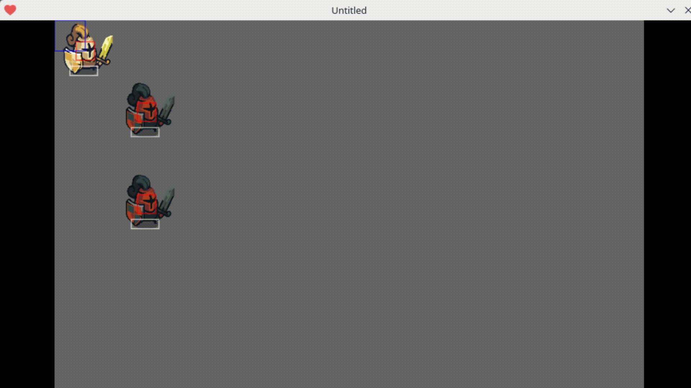

# YASOULS (Yet Another Souls-like)



The Soulslike in the name is mostly because I loved the parry mechanic in From Software's Sekiro:Shadows die twice. After watching a video of a person making their game with duck ([clicky](https://www.youtube.com/watch?v=py0U3Bq8azI&t)) I got inspired! I didn't want to make a 3D though, I also really like beat'em ups. So YASOULs is born! Another motivation to start this project was that I really want to be able to play in my other project that you can check here: [clicky](https://non4to.github.io/fgba-project.html).

[FinalNameTBT] is an action-oriented game focusing on parry mechanics, modular behavior for enemies, and a planned evolutionary AI backend. 

---

## 🎯 Project Vision & Core Motivations

The core ideas for **YASOULS** revolve around two main pillars:
1. **Parry Mechanics:** Inspired by FromSoftware's *Sekiro: Shadows Die Twice*—the game that ignited my passion for the whole genre. I'm a big FromSoft fan now.
2. **Dynamic Adaptive Difficulty via Evolutionary Algorithms:** As a researcher in **Evolutionary Computation**, my long-term goal is to move past static, predictable AI scripts. Instead, the game will feature waves of enemies that continuously evolve their behavioral models based on the player's playstyle, strategy, and vulnerabilities. 

This adaptive loop is conceptually inspired by [*Galactic Arms Race*](https://store.steampowered.com/app/249610/Galactic_Arms_Race/), which evolved weapon mechanics based on player preferences. In **YASOULS**, the idea is that evolutionary pressures will drive behavioral diversity and emergent difficulty across successive survival waves.

---

## ⚙️ Architectural Journey & Multi-Platform Strategy

This project serves as a continuous study in engine architectures, hardware limitations, performant game loops and even programming languages. Which is one of the reasons I'm taking my time with it.:
* **Phase 1 (Godot Engine):** The initial idea was to use Godot to get used to the engine. So I initially prototyped in Godot, but as [FGba](https://non4to.github.io/fgba-project.html) took form, I decided to migrate to something that I was more confortable with and something that I thought would be lighter to run in FGba.
* **Phase 2 (LÖVE2D / Lua) - *Current Stage*:** Migrated to Lua/LÖVE2D to design a highly lightweight, lower-level framework. This transition allowed me to fully control the finite state machines (FSMs) pattern. As I'm confortable with LUA (experience with pico8) it's also easier to focus on design patterns and apply the logics to build the main aspects of the gameplay, such as the parry mechanic.
* **Phase 3 (Planned C++ Migration & GBA Target):** The last technical milestone is to port this entire custom framework to **C++** and deploy it onto [FGba](https://non4to.github.io/fgba-project.html) I have built. The main goal is to have an opportunity to get used to a language I don't use daily now.

---

## 🚀 Current Implementation Status

The project is currently focused on **Combat Feel**. 

* **Frame-Perfect Deflect/Parry Windows:** Timing tables handle specific frame windows for standard blocks, active parries (`PARRY_WINDOW`), and stagger thresholds (`HITSTOP_STANDARD`).
* **Granular Hitbox Management:** Integration with a collision library (`Bump.lua`) separating collision layers into `SOLID` (world collision), `HURTBOX` (damage susceptibility), `ATKBOX` (active frames), and `GUARDBOX` (active deflection frames).
* **State-Machine Driven Actors:** Both the player and the foundational enemy (`Black Knight`) utilize an explicit, decoupleable state machine arch (`idle`, `run`, `atk1`, `atk2`, `guard`, `parry`, `hurt`, `stagger`).

### Next Milestones: Action Pools & Visual Grammar
The idea is to have states that describe the actions enemies may take. This way it'll be possible to define limitations, like, how long charge attacks may charge, or the lenght of a combo and so on. This modular state architeture also eases the crossover between enemies patterns that'll happen in the evolutionary process.

* **Action Variation:** Expand enemy actions to include multi-hit combos, variable-delay charged attacks, active guards, and mobility skills. 
* **Visual Indication:** Implement visual identifiers to assist human pattern recognition while maintaining a challenging environment. For example: Enemies with blue helmet mean they have a charger attack, or enemy with a red sword mean they have a random attack that the player will only know once they use it, and so on. The idea is that the player may learn attack from fighting enemies, but still needs to adapt to attack (and enemies) combinations.
* **Define Enemies pattern:** Each enemy will have a pattern that will work as a gene for the evolutionary algorithm. This definition is very important as it not only it needs to be able to generate valid baheviors from a crossover between two different structures but also may carry restrictions due to balance reasons.

---

## 📦 Project Structure

```bash
YASOULS/
├── main.lua                # Setup, core loops (load/update/draw), and globals
├── tools.lua               # Helper utilities
├── player/                 # Player-specific FSM and telemetry
│   ├── player.lua
│   ├── baseState.lua
│   └── states/             # Individual player state behaviors (atk, guard, parry, etc.)
├── enemies/                # Enemy frameworks
│   ├── baseEnemy.lua       # Inheritable blueprint for AI actors
│   └── blackknight/        # First fully realized opponent using the custom FSM
│       ├── blackknight.lua
│       ├── bkBaseState.lua
│       └── states/         # Knight specific state machine states
└── external/               # Third-party utilities (e.g., Bump for collision, Push for display)
```

---

## 🛠️ How to Run (LÖVE2D Environment)

### Prerequisites
Ensure you have the LÖVE2D framework installed, or use the pre-compiled AppImage located in the project's root directory (Linux x86_64).

### Running via Terminal
Clone the repository, navigate into the directory, and invoke the engine pointing to the root workspace folder:

```bash
# Using the local AppImage (Linux)
chmod +x love-11.5-x86_64.AppImage
./love-11.5-x86_64.AppImage .

# Using a system-wide LÖVE installation
love .
```

---

## 🎨 Asset Credits

I'm not an artist myself, but I'm lucky people make some of their artwork for free for people like me. These are the Assets I have been using in this project (creative commons assets):
* **Visuals:** [Tiny Swords Pack](https://pixelfrog-assets.itch.io/tiny-swords) by *Pixel Frog*.
* **Acoustics:** [Free Fantasy 200 SFX Pack](https://tommusic.itch.io/free-fantasy-200-sfx-pack) by *Tom Music*.